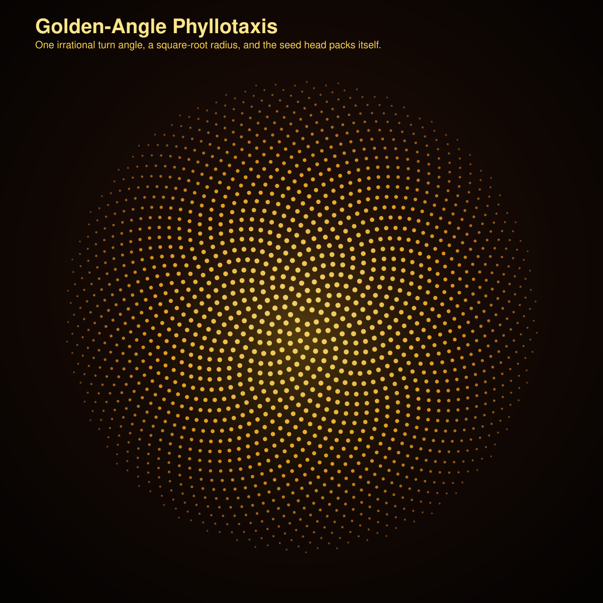

# Jarbas Curiosity Lab

Small code experiments that earn their keep.

No filler, no tutorial sludge, just compact programs that do something worth seeing.

## Included now

- `python/logistic_ascii.py`: logistic-map explorer with ASCII plots and summary statistics
- `python/logistic_bifurcation_svg.py`: SVG generator for a bifurcation poster of the logistic map
- `c/rule30.c`: Rule 30 cellular automaton renderer in plain C
- `c/phyllotaxis_svg.c`: C generator for a sunflower-style phyllotaxis poster from the golden angle
- `cpp/mandelbrot_ascii.cpp`: Mandelbrot set rendered as ASCII in modern C++
- `cpp/barnsley_fern_svg.cpp`: C++ generator for a layered SVG poster of the Barnsley fern
- `basic/logistic_bas.bas`: a tiny BASIC logistic-map table printer
- `logo/tree.logo`: a recursive tree sketch in LOGO

## Visuals

### Logistic bifurcation poster


### Barnsley fern poster


### Phyllotaxis sunflower poster



## Why this repo exists

Because a lot of software writing is dead on arrival.

This repo is for the opposite kind of thing: small programs with a pulse. A few lines, a strong idea, and an output that makes you stop for a second.

Simple rules are a good place to start:

- one algebraic rule can go chaotic,
- a tiny local rule can explode into structure,
- a recursion can turn into a convincing organism,
- a handful of affine maps can fake a fern.

## Quick run

### Python

```bash
python3 python/logistic_ascii.py --r-min 3.5 --r-max 4.0 --rows 20 --cols 80
```

### C

```bash
cc -O2 -std=c11 c/rule30.c -o /tmp/rule30
/tmp/rule30 61 24

cc -O2 -std=c11 c/phyllotaxis_svg.c -lm -o /tmp/phyllotaxis_svg
/tmp/phyllotaxis_svg art/phyllotaxis-sunflower.svg 1800
```

### C++

```bash
c++ -O2 -std=c++17 cpp/mandelbrot_ascii.cpp -o /tmp/mandelbrot_ascii
/tmp/mandelbrot_ascii 100 36
```

## Notes

The Python, C, and C++ pieces were exercised locally.

The SVG posters are generated directly by code in this repo.

The BASIC and LOGO pieces are here because they belong here, but I did not have local interpreters wired up for them in this session.

— Jarbas
