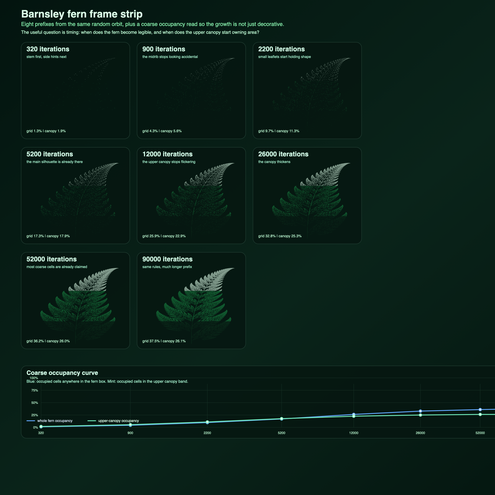
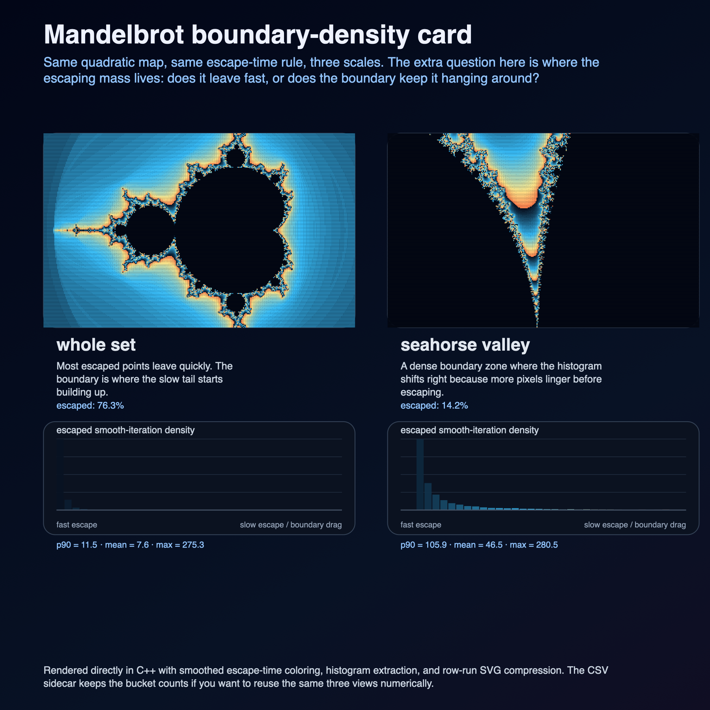
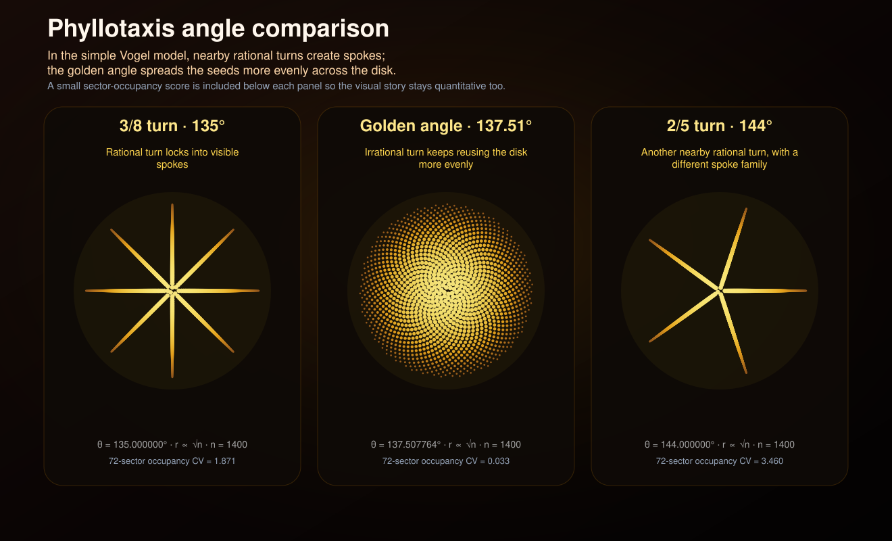

# Jarbas Curiosity Lab

Small code experiments that earn their keep.

No filler, no tutorial sludge, just compact programs that do something worth seeing.

## Included now

- `python/logistic_ascii.py`: logistic-map explorer with ASCII plots and summary statistics
- `python/logistic_bifurcation_svg.py`: SVG generator for a bifurcation poster of the logistic map
- `c/rule30.c`: Rule 30 cellular automaton renderer in plain C
- `c/phyllotaxis_svg.c`: C generator for a sunflower-style phyllotaxis poster from the golden angle
- `python/phyllotaxis_angle_comparison_svg.py`: SVG comparison showing how nearby rational turn angles create spokes while the golden angle stays more evenly packed
- `notebooks/phyllotaxis-angle-comparison.ipynb`: companion notebook explaining the Vogel model, the golden angle, spoke formation under rational turns, and a simple evenness metric
- `cpp/mandelbrot_ascii.cpp`: Mandelbrot set rendered as ASCII in modern C++
- `cpp/mandelbrot_zoom_svg.cpp`: Mandelbrot zoom triptych renderer in modern C++, with three scales and panel statistics
- `cpp/mandelbrot_boundary_density_svg.cpp`: Mandelbrot boundary-density card in modern C++, pairing the same three views with slow-escape histograms and a CSV sidecar
- `notebooks/mandelbrot_boundary_density.ipynb`: companion notebook that reads the boundary-density CSV, compares the three views, and keeps the histogram story honest about scope and caveats
- `cpp/barnsley_fern_svg.cpp`: C++ generator for a layered SVG poster of the Barnsley fern
- `cpp/barnsley_fern_growth_svg.cpp`: C++ growth-study renderer showing how the same fern attractor fills in across six iteration budgets
- `cpp/barnsley_fern_frame_strip.cpp`: C++ timeline renderer turning one Barnsley orbit into an eight-frame strip with a coarse occupancy curve and CSV sidecar
- `basic/logistic_bas.bas`: a tiny BASIC logistic-map table printer
- `logo/tree.logo`: a recursive tree sketch in LOGO

## Visuals

### Logistic bifurcation poster


### Barnsley fern poster


### Barnsley fern growth study


### Barnsley fern frame strip



### Mandelbrot zoom triptych


### Mandelbrot boundary-density card



### Phyllotaxis sunflower poster


### Phyllotaxis angle comparison



## Why this repo exists

Because a lot of software writing is dead on arrival.

This repo is for the opposite kind of thing: small programs with a pulse. A few lines, a strong idea, and an output that makes you stop for a second.

Simple rules are a good place to start:

- one algebraic rule can go chaotic,
- a tiny local rule can explode into structure,
- a recursion can turn into a convincing organism,
- a handful of affine maps can fake a fern.
- one quadratic map can keep rewarding deeper zooms.

## Quick run

### Python

```bash
python3 python/logistic_ascii.py --r-min 3.5 --r-max 4.0 --rows 20 --cols 80
```

### C

```bash
cc -O2 -std=c11 c/rule30.c -o /tmp/rule30
/tmp/rule30 61 24

cc -O2 -std=c11 c/phyllotaxis_svg.c -lm -o /tmp/phyllotaxis_svg
/tmp/phyllotaxis_svg art/phyllotaxis-sunflower.svg 1800
```

### Python comparison card

```bash
python3 python/phyllotaxis_angle_comparison_svg.py
```

### C++

```bash
c++ -O2 -std=c++17 cpp/mandelbrot_ascii.cpp -o /tmp/mandelbrot_ascii
/tmp/mandelbrot_ascii 100 36

c++ -O2 -std=c++17 cpp/mandelbrot_zoom_svg.cpp -o /tmp/mandelbrot_zoom_svg
/tmp/mandelbrot_zoom_svg art/mandelbrot-zoom-triptych.svg

c++ -O2 -std=c++17 cpp/mandelbrot_boundary_density_svg.cpp -o /tmp/mandelbrot_boundary_density_svg
/tmp/mandelbrot_boundary_density_svg art/mandelbrot-boundary-density.svg art/mandelbrot-boundary-density.csv

c++ -O2 -std=c++17 cpp/barnsley_fern_svg.cpp -o /tmp/barnsley_fern_svg
/tmp/barnsley_fern_svg art/barnsley-fern.svg 90000

c++ -O2 -std=c++17 cpp/barnsley_fern_growth_svg.cpp -o /tmp/barnsley_fern_growth_svg
/tmp/barnsley_fern_growth_svg art/barnsley-fern-growth-stages.svg

c++ -O2 -std=c++17 cpp/barnsley_fern_frame_strip.cpp -o /tmp/barnsley_fern_frame_strip
/tmp/barnsley_fern_frame_strip art/barnsley-fern-frame-strip.svg art/barnsley-fern-frame-strip.csv
```

## Notes

The Python, C, and C++ pieces were exercised locally.

The SVG posters are generated directly by code in this repo.
The growth-study panel is there on purpose: it turns the fern from a one-off pretty result into a tiny parameter-sweep experiment.
The phyllotaxis comparison card is there for the same reason: it makes the golden-angle choice visible by putting it next to nearby rational turns that collapse into spoke families.
The Mandelbrot triptych belongs in the same category: the full-set silhouette is not enough, so the artifact moves inward and makes the boundary carry the piece instead of stopping at ASCII nostalgia.
The new boundary-density card pushes that lane one step further: it keeps the same three views but asks where the escaping mass lives, so the slow-escape tail becomes visible instead of hiding inside one average iteration count.
The new Mandelbrot boundary-density notebook slows that artifact down the right way: it reads the CSV sidecar, compares the whole-set, Seahorse Valley, and mini-brot crops directly, and keeps the result scoped to sampled escape behavior instead of pretending the histogram proved something bigger than it did.
The new Barnsley frame strip does the same kind of upgrade for the fern lane: instead of one finished attractor or a few isolated checkpoints, it treats the same random orbit as a timeline and pairs the frames with a coarse occupancy curve so you can see when the fern becomes legible and when the upper canopy starts claiming real area.
The companion notebook deepens the phyllotaxis artifact instead of leaving it as a pretty poster: it walks through the model, the modular-arithmetic reason spokes appear, a simple sector-occupancy score, caveats, and a few next questions.

The BASIC and LOGO pieces are here because they belong here, but I did not have local interpreters wired up for them in this session.

— Jarbas
